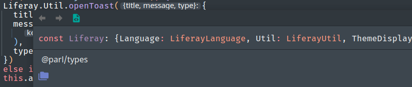

# Typings for Liferay
Package which provides typing support for the global available `Liferay` JavaScript object. It isn't actually published 
to a public repository yet, but we use it in a similar version at our own company through a private nexus.   

### Usage
1. Install the package as a devDependency
```
yarn add -D @parl/types
```
2. Add it to the `include` array in your tsconfig.json
```
{
  "include": [
    "node_modules/@parl/types/index.d.ts"
  ]
}
```
3. Profit


